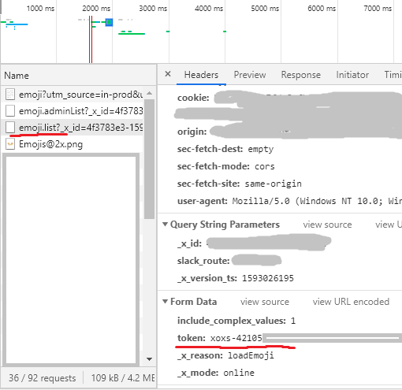

# Moji Manager

For copying emoji from your slack workspace and bulk uploading folders.

## Modes

### Collect

Fetch the listing of the custom emoji in the workspace corresponding to the api key provided and download all images to a folder.  Each file name is taken from the emoji name.  Aliases are not handled.

#### Args

* --token (String, required) - api key
* --collect (no arg) - enable this mode
* --workspace, -w (String, default: 'workspace') - folder name to write summary and images to
* --configfile - file containing workspace->token configuration

#### Sample

`python manage.py --token xoxp-******** --collect --workspace my_data`

`python manage.py --collect --workspace teamname`

`python manage.py --collect`  - will use `default` token from config

### Create

Upload all images in a given folder to the workspace corresponding to the api key provided use the file name as the emoji name.

#### Args

* --token (String) - api key needs to be sniffed from the web ui
* --workspace (String) - config section to pull the token from
* --create (String, required) - path to the folder to upload.
* --batch_size (int, default: 8) - Number of files to upload before sleeping.  This is to prevent rate limiting.
* --recursive - Process the given folder recursively
* --configfile - file containing workspace->token configuration

#### Sample

`python manage.py --token xoxs-********* --create data/sample/`

`python manage.py --workspace allmyfriends --create data/parrots/`

`python manage.py --create . ---workspace allmyfriends --recursive`

### Approve

Takes a user's photo and adds a green circle with a checkbox to the top right

#### Args

* --approve (String) - Term to search by. User id or name
* --push - Push to the workspace rather than just generate the icon

#### Sample

`python --approve "Ben" --workspace thegoodplace`

`python --approve "Ben" --workspace thegoodplace --push`

### Intensify

Makes an emoji shake

#### Args

* --intensify (String) - Term to search by. emoji name, alias not supported
* --push - Push to the workspace rather than just generate the icon

#### Sample

`python --approve "waiting" --workspace thegoodplace`

`python --approve "waiting" --workspace thegoodplace --push`

## Tokens

`window.prompt("your api token is: ", TS.boot_data.api_token)`

Tokens

To get your xoxs-##### token for uploading, open the customize page in your browser, then open the console and execute following line:
   
You can also find it yourself by opening the networking tab in the developer pane, and find a request with the token included (emoji.list for example)

### Management

When you use a token with the `--workspace` option, it will be saved in a config file.  After that, using the `--workspace` option will pull the token from the config file.  You can also use `--workspace default` and after it is stored, it will be fetched when no alternatives are given.

The default location of the config file is `~/.mojimanjerconfig` but can be specified with the `--config` option.

